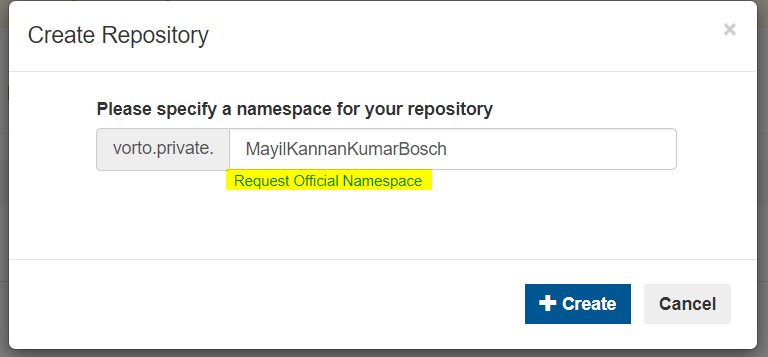

# Managing Repositories

An administrator can create his own private repository by navigating to the 'Manage Repositories' page, by clicking the 'Manage' tab as shown below:

If the user does not have any repositories, then a link for repository creation will be displayed as shown below:

***Creating Repositories***
On clicking the link, the user will get a pop-up which enables repository creation. The Namespace field will be auto-populated with the user ID, if needed it can be edited.

Users can also click the 'Create Repository' button for creating a repository.

In addition to the namespace, an official namespace can also be requested by clicking the highlighted link below:

On clicking the link the user's default mail client will open up with pre-populated subject and recipients.

***Updating Repositories***
The repository can be updated by clicking the icon highlighted below:

On clicking the link, the user will get a pop-up which enables editing and adding more namespaces to the repository, a new namespace can be added by clicking the highlighted button as below:

In addition to the namespace, an official namespace can also be requested by clicking the highlighted link below:

