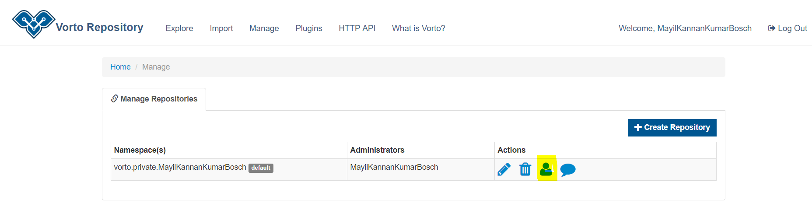

# Managing Repositories  

An administrator can create his own private repository (restricted to 1 repository per user) by navigating to the 'Manage Repositories' page, by clicking the 'Manage' tab as shown below:  

  
  

If the user does not have any repositories, then a link for repository creation will be displayed as shown below:  

  
  

 ***Creating Repositories***  
 
 On clicking the link, the user will get a pop-up which enables repository creation. The Namespace field will be auto-populated with the user ID, if needed it can be edited.  

Users can also click the 'Create Repository' button for creating a repository.  

  
  

In addition to the namespace, an official namespace can also be requested by clicking the highlighted link below:  

  
  

On clicking the link the user's default mail client will open up with pre-populated subject and recipients.   

  
  

***Updating Repositories***  

The repository can be updated by clicking the icon highlighted below:  

  
  

On clicking the link, the user will get a pop-up which enables editing and adding more namespaces to the repository, a new namespace can be added by clicking the highlighted button as below:  

  
  

In addition to the namespace, an official namespace can also be requested by clicking the highlighted link below:  

  
  

On clicking the link the user's default mail client will open up with pre-populated subject and recipients.   

  
  

***Manage Collaborators***  

Collaborators can be managed by clicking the link as highlighted below. This option enables the user to manage his/her roles and also adding/updating additional user roles.  

  
  

On clicking the link, a pop-up with the default collaborator roles will be displayed as below:  
  
  
  

The user roles can be edited by clicking the edit icon as below:  

  
  

The roles will be listed as below:  

  
  

The roles and their corresponding permission are listed below:  

- VIEW permission to browse models
- CREATE permission to create and modify models
- PROMOTE permission to release models
- REVIEW permission to review and approve models
- Administrator permission to manage the current repository  

